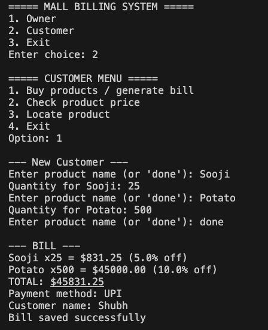

# Mall Billing System

## Table of Contents
1. [Project Overview](#project-overview)  
2. [Features](#features)  
3. [Technologies Used](#technologies-used)  
4. [Project Structure](#project-structure)  
5. [Setup Instructions](#setup-instructions)  
6. [How to Use](#how-to-use)  
7. [Sample Output](#sample-output)  
8. [Future Enhancements](#future-enhancements)  
9. [Author](#author)  

---

## Project Overview

The **Mall Billing System** is a console-based Python application designed for a small retail store or mall.  

- **Owners** can manage the inventory.  
- **Customers** can purchase items and generate bills automatically.  

This project demonstrates **file handling, modular programming, and basic user interface** in Python.

---

## Features

### Owner Features
- Add new products to inventory  
- Replenish stock of existing products  
- View complete product list  
- Check for low stock alerts  
- Logs all owner actions in `owner_logs.txt`  

### Customer Features
- Purchase products and generate bills  
- Check product price and discount  
- Locate product in the store  
- Bills are saved in `customers.txt` with date and time  

---

## Technologies Used
- **Python 3** – Main programming language  
- **File Handling** – Persistent storage using `.txt` files  
- **Datetime** – For logging transactions and timestamps  

---

## Project Structure

> **Note:** All `.txt` files are inside the `src/data/` folder.  

---

## Setup Instructions

1. Clone or download the repository.  
2. Open a terminal and navigate to the `src` folder:
3. Make sure the `data` folder exists (it will be automatically created if missing).  
4. Run the program:

---

## How to Use

### Owner Menu
1. Select **Owner** from the main menu.  
2. Options include:
- Add new product  
- Replenish stock  
- Show complete inventory  
- Check low stock  
3. Exit to return to the main menu.  

### Customer Menu
1. Select **Customer** from the main menu.  
2. Options include:
- Buy products / generate bill  
- Check product price  
- Locate product  
3. Exit to return to the main menu.  

> All updates, bills, and logs are automatically saved in `src/data/`.

---

## Sample Output

**Owner – Show Inventory**  

**Customer – Generate Bill**  

---

## Future Enhancements
- GUI using Tkinter or PyQt  
- Category-based inventory  
- Search & filter products  
- Discount coupons / promotions  
- Multi-customer support with unique bill numbers  

---

## Author
- **Project:** Mall Billing System
- **Name:** Shubh Gupta  
- **Course:** B.Tech 1st Year CSE(AIML) 
- **Registration:** 25BAI10562 
- **Skills Demonstrated:** Python programming, file handling, modular code, simple UI design